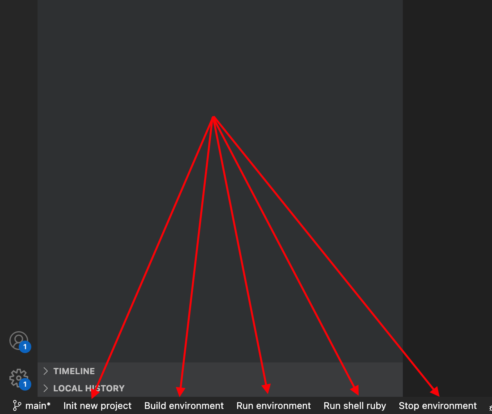

## Visual Studio Code guys
Install the extensions
* [Ruby Debug](https://marketplace.visualstudio.com/items?itemName=castwide.ruby-debug)
* [Tasks](https://marketplace.visualstudio.com/items?itemName=actboy168.tasks)

Then you should be able to see a list of prepared tasks for creating and running new ROR application like in the screenshot

Here is the meaning of the tasks:
* `Init new project` - use this task just once to initialize a new project
* `Build environment` - this task builds the environment. Use it when you need to build the environment changes or when you need to commit your changes in Gemfile in your environment.
* `Run environment` - this task runs the environment. Use it when you need to run the project also this task starts the debugger session and waits for the debugger connection. Read more about debugger [here](https://github.com/rubyide/vscode-ruby/wiki/3.-Attaching-to-a-debugger) 
* `Run shell ruby` - this task teleports you to the command shell  where you can execute **rails**, **rake**, **bundle**, etc. commands.
* `Stop environment` - this task stops the environment.

By default, your app will be initialized in ./application directory. But you can change it for any other you like in the .env.example file which is in the ./environment directory.

You can change very basic environment variables for your application with .env.example file. Like so: 
* PROJECT_NAME
* APP_PATH
* DB_PORT
* DB_NAME
* DB_USER
* DB_PASSWORD

Basically this is all you need to start your new cool project. Using Visual Studio Code.

After your VSCode has been connected to the debugger session your project will be able to visit by `http://${PROJECT_NAME}.localhost`. By default, it's `http://test_project.localhost`.
